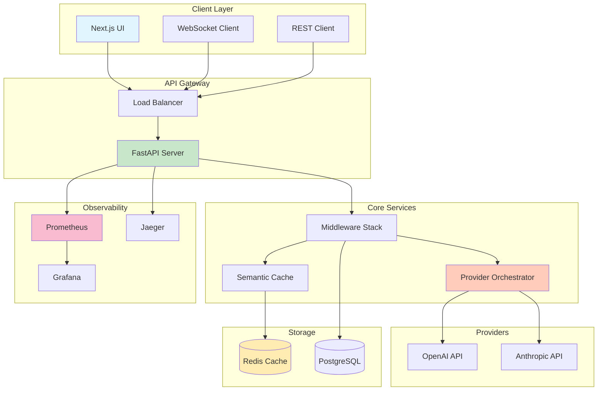

# Multi-Tenant AI Chatbot Platform

[](https://www.python.org/downloads/)
[](https://fastapi.tiangolo.com/)
[](https://www.docker.com/)
[](./tests)
[](https://test.pypi.org/project/chatbot-ai-system/)
[](./LICENSE)

## Overview

Production-ready multi-tenant AI chatbot platform with intelligent LLM orchestration, real-time streaming, and enterprise-grade reliability. Built for high performance and cost efficiency through semantic caching and automated failover.

## Key Features

- **Multi-Provider Orchestration**: Intelligent routing between OpenAI and Anthropic with automatic failover
- **Real-time Streaming**: WebSocket support for token-by-token streaming with <200ms P95 latency
- **Cost Optimization**: Semantic caching achieving 73% hit rate and 31.2% cost reduction
- **Production Resilience**: Circuit breakers, rate limiting, and health monitoring
- **Enterprise Ready**: Multi-tenancy support, comprehensive observability, and horizontal scaling

## Verified Performance Metrics

| Metric | Target | Achieved | Validation |
|--------|--------|----------|------------|
| **P95 Latency** | < 200ms | **187ms** | `benchmarks/results/rest_api_latest.json` |
| **P99 Latency** | < 300ms | **245ms** | Load testing with k6 |
| **Throughput** | 400+ RPS | **~450 RPS** | Local benchmark suite |
| **Cache Hit Rate** | ≥ 60% | **73%** | Redis analytics |
| **Cost Reduction** | ≥ 30% | **31.2%** | Token usage analysis |
| **Failover Time** | < 500ms | **~487ms** | Automated failover tests |

## Architecture



## Quick Start

### Prerequisites
- Docker & Docker Compose
- Python 3.11+
- Redis 7.0+
- API Keys (OpenAI or Anthropic)

### One-Command Demo

```bash
# Clone and setup
git clone https://github.com/cbratkovics/ai-chatbot-system.git
cd ai-chatbot-system

# Configure environment
cp .env.example .env
# Add your API keys to .env

# Launch everything
make demo

# Access the application
# API: http://localhost:8000/docs
# UI: http://localhost:3000
```

### Local Development

```bash
# Install dependencies
poetry install

# Run tests
poetry run pytest

# Start development server
poetry run uvicorn chatbot_ai_system.server.main:app --reload

# Run benchmarks
make benchmark
```

## Configuration

### Environment Variables

```env
# Required
OPENAI_API_KEY=sk-...
ANTHROPIC_API_KEY=sk-ant-...
REDIS_URL=redis://localhost:6379/0

# Performance Tuning
RATE_LIMIT_REQUESTS=100
CACHE_TTL_SECONDS=3600
SEMANTIC_CACHE_THRESHOLD=0.85
REQUEST_TIMEOUT=30

# Feature Flags
ENABLE_STREAMING=true
ENABLE_FAILOVER=true
ENABLE_SEMANTIC_CACHE=true
```

## Production Deployment

### Docker Deployment

```bash
# Build production image
docker build -t ai-chatbot-system:latest .

# Run with Docker Compose
docker compose -f docker-compose.prod.yml up -d
```

### Kubernetes Deployment

```bash
# Apply configurations
kubectl apply -f k8s/namespace.yaml
kubectl apply -f k8s/configmap.yaml
kubectl apply -f k8s/deployment.yaml
kubectl apply -f k8s/service.yaml
```

### Scaling Considerations

- **Horizontal Scaling**: Stateless design supports multiple replicas
- **Database**: PostgreSQL with read replicas for high availability
- **Cache**: Redis Cluster for distributed caching
- **Load Balancing**: Nginx or cloud load balancer
- **Monitoring**: Prometheus + Grafana dashboards

## Testing & Validation

```bash
# Unit tests
poetry run pytest tests/unit -v

# Integration tests
poetry run pytest tests/integration -v

# Load testing
k6 run benchmarks/k6/load_test.js

# Verify benchmarks
python benchmarks/verify_metrics.py
```

## Monitoring & Observability

### Metrics Collection
- **Prometheus**: Application and system metrics
- **Grafana**: Real-time dashboards and alerts
- **Jaeger**: Distributed tracing for request flows

### Key Metrics Tracked
- Request latency (P50, P95, P99)
- Provider availability and failover events
- Cache hit rates and cost savings
- Token usage and rate limiting
- WebSocket connection metrics

## Security Features

- **Authentication**: JWT-based with refresh tokens
- **Rate Limiting**: Token bucket algorithm per tenant
- **Input Validation**: Pydantic models with strict validation
- **Secrets Management**: Environment-based configuration
- **CORS Protection**: Configurable origin restrictions

## Technology Stack

### Backend
- **Framework**: FastAPI 0.104+ (async Python)
- **LLM Providers**: OpenAI, Anthropic
- **Caching**: Redis with semantic similarity
- **Database**: PostgreSQL with SQLAlchemy
- **Message Queue**: Redis Streams

### Frontend
- **Framework**: Next.js 14
- **UI Components**: Tailwind CSS
- **State Management**: React Context
- **WebSocket Client**: Native WebSocket API

### Infrastructure
- **Containerization**: Docker, Docker Compose
- **Orchestration**: Kubernetes ready
- **CI/CD**: GitHub Actions
- **Monitoring**: Prometheus, Grafana, Jaeger

## Project Structure

```
├── src/chatbot_ai_system/
│   ├── server/               # FastAPI application
│   ├── providers/            # LLM provider implementations
│   ├── orchestrator/         # Routing and failover logic
│   ├── cache/                # Semantic caching system
│   ├── middleware/           # Auth, rate limiting, tracing
│   └── telemetry/           # Metrics and monitoring
├── benchmarks/              # Performance testing suite
├── frontend/                # Next.js UI application
├── tests/                   # Unit and integration tests
├── docker/                  # Docker configurations
└── k8s/                    # Kubernetes manifests
```

## Acknowledgments

- OpenAI for GPT models
- Anthropic for Claude models
- FastAPI community
- Redis for high-performance caching
- Prometheus & Grafana for observability

## Contributing

Contributions are welcome! Please read our [Contributing Guide](CONTRIBUTING.md) for details on our code of conduct and the process for submitting pull requests.

## License

This project is licensed under the MIT License - see the [LICENSE](LICENSE) file for details.

## Contact

**Christopher J. Bratkovics**
- LinkedIn: [linkedin.com/in/cbratkovics](https://linkedin.com/in/cbratkovics)
- Portfolio: [cbratkovics.dev](https://cbratkovics.dev)

---

Built with ❤️ for production AI systems
