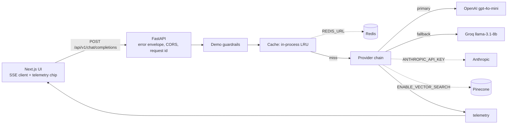

# Multi-Provider AI Chat Platform

[](./LICENSE)
[](https://www.python.org/downloads/)
[](https://nodejs.org/)
[](https://fastapi.tiangolo.com/)
[](https://github.com/astral-sh/ruff)
[](https://github.com/cbratkovics/chatbot-ai-system/actions)

A FastAPI + Next.js chat service that shows its own engineering on screen: every answer
carries a telemetry chip with the provider that answered, the model, cache HIT/MISS, latency,
token counts, estimated cost, and the failover log for that request.

## Live demo

**[chatbot-ai-system.vercel.app](https://chatbot-ai-system.vercel.app)** — backend on Render's
free tier, so the first request after 15 idle minutes takes 30–60 s while the instance wakes.
The UI says so while it waits.

<!--
  GIF placeholder. Record a ~15 s clip of: (1) a streamed answer, (2) the same question again
  showing "cache HIT", (3) the "Simulate provider failure" toggle producing a "failover" chip.
  Suggested tools: Kap or QuickTime + gifski, 1280x800, <5 MB. Save as docs/images/demo.gif and
  replace this comment with:  
-->

### What to try (3 minutes)

1. **Ask anything.** Watch the answer stream token by token. The chip under it shows
   `openai · gpt-4o-mini`, `cache MISS`, latency, `in / out` tokens, and the estimated cost.
2. **Ask the exact same question again.** The chip flips to `cache HIT`, `$0.00`, and the
   latency drops to single-digit milliseconds. Nothing was sent to a provider.
3. **Tick "Simulate provider failure"** (top right) and ask again. The primary provider is forced
   to fail with a 503 and the request fails over to Groq; the chip shows
   `failover: openai → groq (simulated)`. The error on the primary is real code path, the outage
   is the only thing simulated.
4. **Break it on purpose.** Send eleven messages inside a minute and read the `429 rate_limited`
   banner with its request id. Errors are structured, never "Request failed".

The full walkthrough with talking points is in [`docs/DEMO_SCRIPT.md`](docs/DEMO_SCRIPT.md).

### Runs for ~$0/month

| Component | Service | Monthly cost |
|---|---|---|
| Frontend | Vercel Hobby | $0 |
| Backend API | Render free tier, one worker | $0 |
| Response cache | in-process LRU (Redis optional) | $0 |
| Fallback provider | Groq free tier, `llama-3.1-8b-instant` | $0 |
| Primary provider | OpenAI `gpt-4o-mini`, hard-capped in the OpenAI dashboard | ≤ $5, typically cents |
| Vector search, database, tracing | off by default | $0 |

Spend is bounded twice: demo guardrails (10 req/min and 40 req/day per IP, 400 output tokens,
150k tokens/day total) and a hard limit on the OpenAI account. At list price, the whole daily
token budget on `gpt-4o-mini` is under $0.10.

## What the demo proves

| Claim | Where it lives | How the demo shows it |
|---|---|---|
| Provider failover on 401/402/429/5xx/timeout | [`providers/chain.py`](src/chatbot_ai_system/providers/chain.py) | `attempts[]` in every response; the failure toggle |
| Optional infrastructure, visible degradation | [`cache/memory_cache.py`](src/chatbot_ai_system/cache/memory_cache.py), [`vector_store/__init__.py`](src/chatbot_ai_system/vector_store/__init__.py) | `/health` reports `cache: memory`; app boots with one key and nothing else |
| Exact-match response cache | [`api/chat.py`](src/chatbot_ai_system/api/chat.py) | `cache HIT`, `$0.00` on repeat questions |
| Streaming over plain HTTP | [`api/chat.py`](src/chatbot_ai_system/api/chat.py) (SSE) | live token stream, `ttfb` in the chip |
| Structured errors with real status codes | [`api/errors.py`](src/chatbot_ai_system/api/errors.py) | `402 provider_quota_exhausted [openai]: … · request <id>` |
| Cost control without a database | [`api/guardrails.py`](src/chatbot_ai_system/api/guardrails.py) | friendly 429s; `/chat/health` shows tokens used today |

Design decisions are recorded as short ADRs in [`docs/adr/`](docs/adr/README.md). The diagnosis
that started this work is in [`docs/DIAGNOSIS.md`](docs/DIAGNOSIS.md).

## Architecture

Solid arrows run in the demo. Dashed arrows are available in the codebase and off by default.
Two full views, one per deployment, are in
[`docs/architecture/ARCHITECTURE.md`](docs/architecture/ARCHITECTURE.md).


```mermaid
flowchart LR
    UI[Next.js UI<br/>SSE client + telemetry chip] -->|POST /api/v1/chat/completions| API[FastAPI<br/>error envelope, CORS, request id]
    API --> GUARD[Demo guardrails]
    GUARD --> CACHE[Cache: in-process LRU]
    CACHE -.->|REDIS_URL| REDIS[(Redis)]
    CACHE -->|miss| CHAIN[Provider chain]
    CHAIN -->|primary| OAI[OpenAI gpt-4o-mini]
    CHAIN -->|fallback| GROQ[Groq llama-3.1-8b]
    CHAIN -.->|ANTHROPIC_API_KEY| ANTH[Anthropic]
    CHAIN -.->|ENABLE_VECTOR_SEARCH| PINE[(Pinecone)]
    CHAIN --> TEL[telemetry] --> UI
```

## Measured behaviour

Every number in this section comes from a committed artifact produced by a script in this
repository. There are no other performance claims in this README.

### Live demo benchmark

`scripts/bench_demo.py` sends 20 requests (5 distinct prompts, each repeated 4 times) to the
live API, paced under the demo rate limit, and writes
[`benchmarks/results/bench_demo_latest.json`](benchmarks/results/bench_demo_latest.json).

| Metric | Value |
|---|---|
| Cache hit rate | *run the script* |
| Latency P50 / P95, cache miss | *run the script* |
| Latency P50 / P95, cache hit | *run the script* |
| Failovers observed | *run the script* |

```bash
poetry run python scripts/bench_demo.py                      # live demo, ~2.5 min at 9 req/min
poetry run python scripts/bench_demo.py --base-url http://localhost:8000 --rpm 0 --runs 40
poetry run python scripts/bench_demo.py --simulate-failure   # with DEMO_FAILURE_TOGGLE_ENABLED=true
```

The table above is filled in by hand from the JSON the script writes, and only from that.
Latencies are client-observed from the machine that ran the script.

### Failover control-flow timing

`tests/test_provider_failover.py` times the failover logic of the older `ProviderOrchestrator`
against mocked providers with a synthetic 50 ms base response. It measures detection, timeout
handling, and provider switching, not real provider latency.

| Scenario | Runs | Average failover | P95 failover |
|---|---|---|---|
| Timeout | 10 | 262.2 ms | 262.9 ms |
| Rate limit | 10 | 113.3 ms | 114.4 ms |
| Server error | 10 | 112.7 ms | 113.2 ms |

Source: [`benchmarks/results/failover_timing_latest.json`](benchmarks/results/failover_timing_latest.json).
Regenerate with `BENCHMARK_RESULTS_DIR=benchmarks/results poetry run pytest tests/test_provider_failover.py`
(ordinary test runs write to a gitignored `benchmarks/results/tmp/`).

### Test suite

`poetry run pytest tests/` — 316 passed, 0 failures, 2 strict `xfail`s that document known gaps
(listed in [`docs/TEST_TRIAGE.md`](docs/TEST_TRIAGE.md)). Line coverage measured by
`pytest --cov=chatbot_ai_system` is **31%**: the demo path is covered, the full-deployment
modules (multi-tenancy, orchestration strategies, observability) largely are not.

## Quick start

```bash
git clone https://github.com/cbratkovics/chatbot-ai-system.git
cd chatbot-ai-system
cp .env.example .env            # add OPENAI_API_KEY (and GROQ_API_KEY for failover)
poetry install
poetry run uvicorn chatbot_ai_system.server.main:app --reload

# in another terminal
cd frontend && npm ci && cp .env.example .env.local && npm run dev
```

No Redis, database, or vector store is needed. `GET /health` tells you what the instance is
using:

```json
{"status": "healthy", "checks": {"cache": "memory", "ai_providers": "configured: openai, groq",
 "default_model": "gpt-4o-mini", "fallback_chain": ["groq:llama-3.1-8b-instant"]}}
```

Try the API directly:

```bash
curl -X POST http://localhost:8000/api/v1/chat/completions -H 'Content-Type: application/json' \
  -d '{"model":"gpt-4o-mini","messages":[{"role":"user","content":"Say hi in three words."}]}'

curl -N -X POST http://localhost:8000/api/v1/chat/completions -H 'Content-Type: application/json' \
  -d '{"model":"gpt-4o-mini","messages":[{"role":"user","content":"Count to five."}],"stream":true}'
```

<details>
<summary><strong>Docker Compose</strong></summary>

```bash
cp .env.example .env
docker compose up -d      # backend, frontend, Redis, Postgres (the last two are optional extras)
```

Images live in [`docker/dockerfiles/`](docker/dockerfiles/) (`Dockerfile`, `Dockerfile.production`,
`Dockerfile.test`) and [`frontend/Dockerfile`](frontend/Dockerfile).

</details>

## Configuration

Everything is an environment variable with a safe default; see [`.env.example`](.env.example)
for the full list with comments. The ones that matter:

| Variable | Default | Purpose |
|---|---|---|
| `OPENAI_API_KEY` | | primary provider (required unless another key is set) |
| `GROQ_API_KEY` | | free-tier fallback provider |
| `DEFAULT_MODEL` | `gpt-4o-mini` | legacy ids such as `gpt-3.5-turbo` are mapped forward |
| `FALLBACK_MODELS` | `groq:llama-3.1-8b-instant` | comma-separated `provider:model` chain |
| `REDIS_URL` | unset | set to use Redis; unreachable or unset falls back to memory |
| `SEMANTIC_CACHE_ENABLED` | `false` | TF-IDF similarity matching (loads scikit-learn) |
| `ENABLE_VECTOR_SEARCH` | `false` | Pinecone retrieval; nothing imports Pinecone unless true |
| `DEMO_*` | see file | per-IP limits, token cap, history cap, daily budget |
| `DEMO_FAILURE_TOGGLE_ENABLED` | `false` | shows the failure switch; header `X-Demo-Simulate-Failure: 1` |

Deployment notes for Render and Vercel: [`render.yaml`](render.yaml) and
[`frontend/DEPLOYMENT.md`](frontend/DEPLOYMENT.md).

## Quality gates

```bash
poetry run ruff check .
poetry run mypy src/ --ignore-missing-imports
poetry run pytest tests/
cd frontend && npx tsc --noEmit && npm run build
```

Tests that need a live service are marked `live` and skip unless `TEST_BASE_URL`,
`TEST_REDIS_URL`, or `TEST_DATABASE_URL` is set.

## What is in the repository beyond the demo

The demo path is `api/chat.py`, `providers/chain.py`, `cache/memory_cache.py`,
`api/guardrails.py`, `api/errors.py`, and the frontend. The rest of `src/chatbot_ai_system/`
(about 34k lines in total) is the full-deployment surface: WebSocket streaming with its own
protocol, a provider orchestrator with load-balancing strategies and circuit breakers,
multi-tenancy and auth routers, Redis and Pinecone integrations, Terraform, Helm charts, and the
Prometheus/Grafana/Jaeger configuration under `infrastructure/` (its README says what is and is
not exercised). Modules that are design sketches rather than runnable code say so in their
first line (`infrastructure/global_routing.py`, `providers/provider_a.py`, `providers/provider_b.py`,
`infrastructure/connection_pool.py`). Known gaps in that surface are listed honestly in
[`docs/TEST_TRIAGE.md`](docs/TEST_TRIAGE.md#escalations-places-where-the-code-not-the-test-looks-wrong).

## Technology

FastAPI 0.104 on Python 3.12, Pydantic 2, the `openai` SDK (also used for Groq via its
OpenAI-compatible endpoint), `anthropic` SDK, `redis` (optional), `tiktoken` for token
estimates. Frontend: Next.js 15, React 19, TypeScript, Tailwind CSS 3.

## License

MIT. See [LICENSE](LICENSE).

## Contact

**Christopher J. Bratkovics** · [linkedin.com/in/cbratkovics](https://linkedin.com/in/cbratkovics) · [cbratkovics.dev](https://cbratkovics.dev) · [@cbratkovics](https://github.com/cbratkovics)
