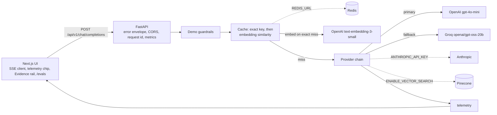

# Multi-Provider AI Chat Platform

[](./LICENSE)
[](https://www.python.org/downloads/)
[](https://nodejs.org/)
[](https://fastapi.tiangolo.com/)
[](https://github.com/astral-sh/ruff)
[](https://github.com/cbratkovics/chatbot-ai-system/actions)

A FastAPI + Next.js LLM gateway that shows its own engineering on screen. Every answer carries
a telemetry chip: the provider and model that answered, cache HIT or MISS with the similarity
score, latency, tokens, cost paid and cost avoided, and the failover chain for that request. An
Evidence rail aggregates the session, a guided demo runs the three headline behaviours with real
requests, and [`/evals`](https://chatbot-ai-system.vercel.app/evals) publishes precision and
recall for the cache from a committed benchmark run.

## Live demo

**[chatbot-ai-system.vercel.app](https://chatbot-ai-system.vercel.app)** — backend on Render's
free tier, so the first request after 15 idle minutes takes 30–60 s while the instance wakes.
The UI says so while it waits.

<!--
  GIF placeholder. Record a ~15 s clip of: (1) a streamed answer, (2) the same question again
  showing "cache HIT", (3) the "Simulate provider failure" toggle producing a "failover" chip.
  Suggested tools: Kap or QuickTime + gifski, 1280x800, <5 MB. Save as docs/images/demo.gif and
  replace this comment with:  
-->

### What to try (one minute)

Press **Demo** and then **Run all**. Three real requests go out, and each step explains what
came back:

1. **A question.** The answer streams token by token; the chip shows `openai · gpt-4o-mini`,
   `cache MISS`, server latency and time to first token, tokens in and out, and the list-price
   cost.
2. **A paraphrase of it.** The semantic cache serves the stored answer without a provider call:
   `cache HIT · semantic 0.93`, the cost paid for the embedding lookup, and the provider cost
   avoided. If it misses, the step says why (similarity below threshold, matching disabled, or
   embeddings unavailable).
3. **A simulated outage.** The primary is forced to fail with a 503 and the fallback answers;
   the chip and the Evidence rail's failover timeline show the attempt chain
   `openai 503 simulated_outage → groq ok`. Only the outage is simulated.

The **Evidence** rail on the right keeps score for the session: cache hit rate, money spent versus
avoided, client-observed P50/P95, time to first token on misses, and every failover. Each tile has
a one-line "why this matters". Then open [`/evals`](https://chatbot-ai-system.vercel.app/evals)
for the offline precision and recall of the cache and the pass rates of the failover and
streaming-contract evals. The talking points are in [`docs/DEMO_SCRIPT.md`](docs/DEMO_SCRIPT.md).

### Screenshots

<!-- Placeholder image paths; drop the PNGs in and remove this comment. Suggested size 1440x900. -->

| Chat with the Evidence rail | Failover chain | `/evals` |
|---|---|---|
|  |  |  |

### Runs for ~$0/month

| Component | Service | Monthly cost |
|---|---|---|
| Frontend | Vercel Hobby | $0 |
| Backend API | Render free tier, one worker | $0 |
| Response cache | in-process LRU (Redis optional) | $0 |
| Fallback provider | Groq free tier, `openai/gpt-oss-20b` | $0 |
| Primary provider | OpenAI `gpt-4o-mini`, hard-capped in the OpenAI dashboard | ≤ $5, typically cents |
| Vector search, database, tracing | off by default | $0 |

Spend is bounded twice: demo guardrails (10 req/min and 40 req/day per IP, 400 output tokens,
150k tokens/day total) and a hard limit on the OpenAI account. At list price, the whole daily
token budget on `gpt-4o-mini` is under $0.10.

## What the demo proves

| Claim | Where it lives | How the demo shows it |
|---|---|---|
| Provider failover on 401/402/429/5xx/timeout | [`providers/chain.py`](src/chatbot_ai_system/providers/chain.py) | `attempts[]` in every response; the failure toggle |
| Optional infrastructure, visible degradation | [`cache/memory_cache.py`](src/chatbot_ai_system/cache/memory_cache.py), [`vector_store/__init__.py`](src/chatbot_ai_system/vector_store/__init__.py) | `/health` reports `cache: memory`; app boots with one key and nothing else |
| Semantic cache, exact key first | [`cache/semantic_match.py`](src/chatbot_ai_system/cache/semantic_match.py), [`api/chat.py`](src/chatbot_ai_system/api/chat.py) | `cache HIT · semantic 0.93` with cost avoided; precision/recall on [`/evals`](https://chatbot-ai-system.vercel.app/evals) |
| Streaming over plain HTTP | [`api/chat.py`](src/chatbot_ai_system/api/chat.py) (SSE) | live token stream, `ttfb` in the chip; contract checked by the SSE eval |
| Observed numbers only | [`frontend/components/evidence/`](frontend/components/evidence/), [`evals/`](evals/) | Evidence rail from session telemetry; `/evals` from the committed artifact (ADR 0006) |
| Structured errors with real status codes | [`api/errors.py`](src/chatbot_ai_system/api/errors.py) | `402 provider_quota_exhausted [openai]: … · request <id>` |
| Cost control without a database | [`api/guardrails.py`](src/chatbot_ai_system/api/guardrails.py) | friendly 429s; `/chat/health` shows tokens used today |

Design decisions are recorded as short ADRs in [`docs/adr/`](docs/adr/README.md). The diagnosis
that started this work is in [`docs/DIAGNOSIS.md`](docs/DIAGNOSIS.md).

## Architecture

Solid arrows run in the demo. Dashed arrows are available in the codebase and off by default.
Two full views, one per deployment, are in
[`docs/architecture/ARCHITECTURE.md`](docs/architecture/ARCHITECTURE.md).


```mermaid
flowchart LR
    UI[Next.js UI<br/>SSE client, telemetry chip, Evidence rail, /evals] -->|POST /api/v1/chat/completions| API[FastAPI<br/>error envelope, CORS, request id, metrics]
    API --> GUARD[Demo guardrails]
    GUARD --> CACHE[Cache: exact key, then<br/>embedding similarity]
    CACHE -.->|REDIS_URL| REDIS[(Redis)]
    CACHE -->|embed on exact miss| EMB[OpenAI text-embedding-3-small]
    CACHE -->|miss| CHAIN[Provider chain]
    CHAIN -->|primary| OAI[OpenAI gpt-4o-mini]
    CHAIN -->|fallback| GROQ[Groq openai/gpt-oss-20b]
    CHAIN -.->|ANTHROPIC_API_KEY| ANTH[Anthropic]
    CHAIN -.->|ENABLE_VECTOR_SEARCH| PINE[(Pinecone)]
    CHAIN --> TEL[telemetry] --> UI
```

## Measured behaviour

Every number in this section comes from a committed artifact produced by a script in this
repository. There are no other performance claims in this README.

### System evals (the numbers)

`make evals` runs four evals against a live backend and commits the result as
[`evals/results/latest.json`](evals/results/latest.json), summarised in
[`evals/results/latest.md`](evals/results/latest.md) and rendered at
[`/evals`](https://chatbot-ai-system.vercel.app/evals) (ADR 0006). This README does not repeat
the numbers; the artifact carries its run timestamp, commit SHA, target and cost.

| Eval | What it measures | Where |
|---|---|---|
| Cache paraphrase | precision, recall, F1 and confusion matrix of the semantic cache on 68 labelled pairs (paraphrases, normalisation, same-words-different-ask, negation and entity-swap traps), plus a threshold sweep that sets `SEMANTIC_CACHE_THRESHOLD` | [`evals/cache_paraphrase_eval.py`](evals/cache_paraphrase_eval.py), [`evals/data/cache_pairs.jsonl`](evals/data/cache_pairs.jsonl) |
| Failover | with the primary forced down: did a different provider answer, was the failure recorded, did the first token still stream; added latency versus baseline | [`evals/failover_eval.py`](evals/failover_eval.py) |
| SSE contract | `meta → delta* → done \| error`, never gzip-compressed, across hits, misses, bypasses and failovers | [`evals/sse_contract_eval.py`](evals/sse_contract_eval.py) |
| Latency | client and server P50/P95/P99 per path (exact hit, semantic hit, miss, failover, bypass) | [`evals/latency_eval.py`](evals/latency_eval.py) |

```bash
# backend with the demo limits off, then:
SEMANTIC_CACHE_ENABLED=true DEMO_GUARDRAILS_ENABLED=false RATE_LIMIT_ENABLED=false make dev
make evals                                   # ~190 requests, ~2.5 min, well under a cent
poetry run python scripts/bench_demo.py      # the older 20-request smoke against the live demo
```

The scoring functions are unit-tested on fixture data (`tests/unit/test_evals_scoring.py`); a run
with any failed request is written to `last-failed.json` and never replaces `latest.json`.

### Failover control-flow timing

`tests/test_provider_failover.py` times the failover logic of the older `ProviderOrchestrator`
against mocked providers with a synthetic 50 ms base response. It measures detection, timeout
handling, and provider switching, not real provider latency.

| Scenario | Runs | Average failover | P95 failover |
|---|---|---|---|
| Timeout | 10 | 262.2 ms | 262.9 ms |
| Rate limit | 10 | 113.3 ms | 114.4 ms |
| Server error | 10 | 112.7 ms | 113.2 ms |

Source: [`benchmarks/results/failover_timing_latest.json`](benchmarks/results/failover_timing_latest.json).
Regenerate with `BENCHMARK_RESULTS_DIR=benchmarks/results poetry run pytest tests/test_provider_failover.py`
(ordinary test runs write to a gitignored `benchmarks/results/tmp/`).

### Test suite

`poetry run pytest tests/` — 355 passed, 48 skipped (live-service tests), 2 strict `xfail`s that
document known gaps (listed in [`docs/TEST_TRIAGE.md`](docs/TEST_TRIAGE.md)). Two tests start a
real uvicorn server: one proves a stream survives the keep-alive timer on a reused connection,
the other that no `BaseHTTPMiddleware` is in the stack (ADR 0005). Frontend: `npm test` runs the
Vitest suites for the Evidence rail's statistics and the `/evals` page helpers. Line coverage of
the backend is **31%**: the demo path is covered, the full-deployment modules (multi-tenancy,
orchestration strategies, observability) largely are not.

## Quick start

```bash
git clone https://github.com/cbratkovics/chatbot-ai-system.git
cd chatbot-ai-system
cp .env.example .env            # add OPENAI_API_KEY (and GROQ_API_KEY for failover)
make install                    # poetry install + npm ci
make dev                        # API on :8000 with hot reload

# in another terminal
cp frontend/.env.example frontend/.env.local
make dev-frontend               # UI on :3000
```

`make` with no arguments lists every target.

No Redis, database, or vector store is needed. `GET /health` tells you what the instance is
using:

```json
{"status": "healthy", "checks": {"cache": "memory", "ai_providers": "configured: openai, groq",
 "default_model": "gpt-4o-mini", "fallback_chain": ["groq:openai/gpt-oss-20b"]}}
```

Try the API directly:

```bash
curl -X POST http://localhost:8000/api/v1/chat/completions -H 'Content-Type: application/json' \
  -d '{"model":"gpt-4o-mini","messages":[{"role":"user","content":"Say hi in three words."}]}'

curl -N -X POST http://localhost:8000/api/v1/chat/completions -H 'Content-Type: application/json' \
  -d '{"model":"gpt-4o-mini","messages":[{"role":"user","content":"Count to five."}],"stream":true}'
```

<details>
<summary><strong>Docker Compose</strong></summary>

```bash
cp .env.example .env
make up          # backend, frontend, Redis, Postgres from docker-compose.yml
make up-full     # adds nginx, Prometheus, Grafana from docker/docker-compose.prod.yml
make down
```

Backend images live in [`docker/dockerfiles/`](docker/dockerfiles/); the frontend image in
[`frontend/Dockerfile`](frontend/Dockerfile) exists for this stack only (the demo frontend runs on Vercel).

</details>

## Configuration

Everything is an environment variable with a safe default; see [`.env.example`](.env.example)
for the full list with comments. The ones that matter:

| Variable | Default | Purpose |
|---|---|---|
| `OPENAI_API_KEY` | | primary provider (required unless another key is set) |
| `GROQ_API_KEY` | | free-tier fallback provider |
| `DEFAULT_MODEL` | `gpt-4o-mini` | legacy ids such as `gpt-3.5-turbo` are mapped forward |
| `FALLBACK_MODELS` | `groq:openai/gpt-oss-20b` | comma-separated `provider:model` chain; retired ids such as `llama-3.1-8b-instant` are mapped forward |
| `REDIS_URL` | unset | set to use Redis; unreachable or unset falls back to memory |
| `SEMANTIC_CACHE_ENABLED` | `true` | paraphrase matching with OpenAI embeddings on an exact miss; degrades to exact-match without a key (ADR 0007) |
| `SEMANTIC_CACHE_THRESHOLD` | `0.76` | F1-optimal value from the eval sweep; change it by re-running `make evals` |
| `SEMANTIC_CACHE_MAX_ENTRIES` | `512` | bound on the in-process embedding index |
| `RATE_LIMIT_ENABLED` | `true` | outer 100 req/min per IP for every route; turn off for eval runs |
| `ENABLE_VECTOR_SEARCH` | `false` | Pinecone retrieval; nothing imports Pinecone unless true |
| `DEMO_*` | see file | per-IP limits, token cap, history cap, daily budget |
| `DEMO_FAILURE_TOGGLE_ENABLED` | `false` | shows the failure switch; header `X-Demo-Simulate-Failure: 1` |

Deployment notes for Render and Vercel: [`render.yaml`](render.yaml) and
[`frontend/DEPLOYMENT.md`](frontend/DEPLOYMENT.md).

## Quality gates

```bash
make check            # ruff + mypy + pytest
make build-frontend   # tsc + next build
cd frontend && npm run lint && npm test
```

Equivalent to `poetry run ruff check .`, `poetry run mypy src/ --ignore-missing-imports`,
`poetry run pytest tests/`, and `cd frontend && npx tsc --noEmit && npm run build`.

Tests that need a live service are marked `live` and skip unless `TEST_BASE_URL`,
`TEST_REDIS_URL`, or `TEST_DATABASE_URL` is set.

## Project structure

```
├── src/chatbot_ai_system/   # backend package (see below)
├── frontend/                # Next.js 15 UI (Vercel); Dockerfile is for the local compose stack only
├── tests/                   # unit, integration (live-service tests gated by env vars), contract, e2e, load
├── evals/                   # system evals, labelled dataset, committed results (make evals)
├── docs/                    # ADRs, diagnosis, test triage, demo script, audits
├── docker/                  # backend Dockerfiles, prod compose, nginx and redis configs
├── infrastructure/          # Terraform, Helm/k8s, monitoring stack: full deployment only, not the demo
├── benchmarks/              # harnesses and the committed results the README cites
├── scripts/                 # bench_demo.py (shares evals.stats)
├── docker-compose.yml       # local dev stack: make up
├── render.yaml              # Render blueprint for the demo backend
└── Makefile                 # make help
```

`src/chatbot_ai_system/`, one level down. The demo path is the first row; the rest is the
full-deployment surface (about 34k lines) and is not exercised by the public demo.

| package | role |
|---|---|
| `api/` (`chat.py`, `errors.py`, `guardrails.py`, `ratelimit.py`, `metrics.py`, `evals.py`), `providers/` (`chain.py`, `catalog.py`, `openai_provider.py`, `groq_provider.py`, `anthropic_provider.py`), `cache/` (`memory_cache.py`, `redis_cache.py`, `semantic_match.py`), `config/`, `server/` | **the demo**: routing, failover, exact-then-semantic cache, guardrails, SSE, Prometheus, eval artifact, app factory |
| `websocket/`, `ws_handlers/`, `streaming/` | WebSocket streaming with its own protocol |
| `orchestration/`, `orchestrator/`, `reliability/` | orchestrator with load-balancing strategies, circuit breakers, retry policies |
| `auth/`, `tenancy/`, `middleware/`, `database/`, `models/`, `schemas/` | multi-tenancy, JWT auth, ORM models |
| `vector_store/` | Pinecone retrieval behind `ENABLE_VECTOR_SEARCH` |
| `monitoring/`, `telemetry/`, `metrics.py` | Prometheus metrics and tracing hooks |
| `finops/`, `benchmarks/`, `sdk/`, `cli.py`, `integrations/`, `services/`, `utils/`, `v1/`, `core/` | cost tracking, client SDK, CLI, and older parallel implementations |
| `infrastructure/` | design sketches, labelled `DESIGN SKETCH - NOT WIRED` in their first line |

Known gaps in the full-deployment surface are listed in
[`docs/TEST_TRIAGE.md`](docs/TEST_TRIAGE.md#escalations-places-where-the-code-not-the-test-looks-wrong).

## Technology

FastAPI 0.104 on Python 3.12, Pydantic 2, the `openai` SDK (chat, embeddings, and Groq via its
OpenAI-compatible endpoint), `anthropic` SDK, `redis` (optional), `tiktoken` for token estimates,
`prometheus_client`. Frontend: Next.js 15, React 19, TypeScript, Tailwind CSS 3, Radix tooltip
and dialog, Vitest. Charts are hand-written SVG; there is no charting library.

## License

MIT. See [LICENSE](LICENSE).

## Contact

**Christopher J. Bratkovics** · [linkedin.com/in/cbratkovics](https://linkedin.com/in/cbratkovics) · [cbratkovics.dev](https://cbratkovics.dev) · [@cbratkovics](https://github.com/cbratkovics)
