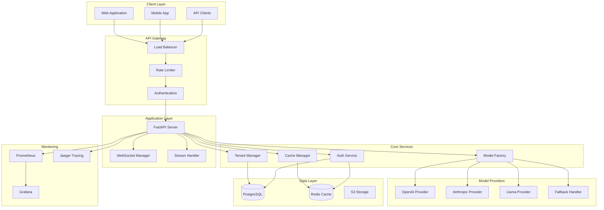

# AI Chatbot System Architecture

## System Overview

The AI Chatbot System is an enterprise-grade, multi-tenant platform that provides intelligent conversational AI capabilities with support for multiple model providers, real-time streaming, semantic caching, and comprehensive monitoring.

## Architecture Diagram



## Component Architecture

### 1. API Gateway Layer

**Load Balancer**
- Nginx-based load balancing with health checks
- Round-robin distribution across application instances
- SSL/TLS termination
- Request routing based on paths and headers

**Rate Limiter**
- Token bucket algorithm for request throttling
- Redis-backed distributed rate limiting
- Tenant-specific rate limits
- Adaptive rate limiting based on system load

**Authentication**
- JWT-based authentication
- API key management
- OAuth 2.0 integration
- Multi-factor authentication support

### 2. Application Layer

**FastAPI Server**
- Asynchronous request handling
- OpenAPI documentation
- Request validation with Pydantic
- Middleware for logging and monitoring

**WebSocket Manager**
- Connection pooling (max 1000 concurrent)
- Heartbeat mechanism (30s interval)
- Room-based broadcasting
- Automatic reconnection handling

**Stream Handler**
- Server-Sent Events (SSE) support
- Chunked transfer encoding
- Stream compression and buffering
- Rate-limited streaming

### 3. Core Services

**Model Factory (Strategy Pattern)**
```python
class ModelFactory:
    def get_provider(model: str) -> Provider
    def process_request(request: Dict) -> Response
    def get_provider_with_load_balancing() -> Provider
```

**Cache Manager**
- Semantic similarity caching using embeddings
- LRU eviction policy
- TTL-based expiration
- Cache warmup and invalidation

**Tenant Manager**
- Complete data isolation
- Resource quota management
- Feature flag control
- Usage tracking and billing

**Auth Service**
- JWT token generation and validation
- API key lifecycle management
- Session management
- Role-based access control (RBAC)

### 4. Model Providers

**Provider Abstraction**
- Unified interface for all providers
- Automatic retry with exponential backoff
- Token counting and cost estimation
- Health checking

**Fallback Handler**
- Circuit breaker pattern (threshold: 5 failures)
- Automatic failover to secondary provider
- Provider health monitoring
- Fallback metrics collection

### 5. Data Layer

**PostgreSQL**
- Primary data store for user data, chats, tenants
- Read replicas for scaling
- Partitioning for large tables
- Connection pooling with asyncpg

**Redis Cache**
- Semantic cache storage
- Session management
- Rate limit counters
- Real-time metrics

**S3 Storage**
- Chat history archival
- Model response caching
- Tenant data backups
- Log storage

## Data Flow

### 1. Standard Request Flow
```
Client → Load Balancer → Rate Limiter → Auth → FastAPI
→ Cache Check → Model Factory → Provider → Response
```

### 2. WebSocket Flow
```
Client → WebSocket Connection → Auth → Room Join
→ Message Stream → Broadcast → Connected Clients
```

### 3. Failover Flow
```
Primary Provider Failure → Circuit Breaker Opens
→ Fallback Handler → Secondary Provider → Response
```

## Technology Stack

### Backend
- **Framework**: FastAPI 0.104+
- **Language**: Python 3.11+
- **Async Runtime**: asyncio, uvicorn
- **WebSockets**: fastapi-websocket

### Databases
- **Primary DB**: PostgreSQL 15+
- **Cache**: Redis 7.0+
- **ORM**: SQLAlchemy 2.0+

### Model Providers
- **OpenAI**: GPT-4, GPT-3.5-turbo
- **Anthropic**: Claude 3 Opus, Sonnet, Haiku
- **Local**: Llama 2, Mistral

### Infrastructure
- **Container**: Docker, Kubernetes
- **CI/CD**: GitHub Actions
- **Monitoring**: Prometheus, Grafana
- **Tracing**: OpenTelemetry, Jaeger

## Scaling Considerations

### Horizontal Scaling
- Stateless application design
- Redis-backed session management
- Database read replicas
- Load balancer distribution

### Vertical Scaling
- Connection pooling optimization
- Memory-efficient caching
- Async I/O operations
- Resource limit configuration

### Performance Targets
- P95 latency: <200ms
- Concurrent users: 100+
- Requests per second: 1000+
- Cache hit rate: >30%

## Security Architecture

### Network Security
- TLS 1.3 for all communications
- VPC isolation for backend services
- Security groups and firewall rules
- DDoS protection

### Application Security
- Input validation and sanitization
- SQL injection prevention
- XSS protection
- CORS configuration

### Data Security
- Encryption at rest (AES-256)
- Encryption in transit (TLS)
- Key rotation policy
- Audit logging

### Tenant Isolation
- Row-level security in PostgreSQL
- Separate Redis keyspaces
- Resource quota enforcement
- Data access logging

## Deployment Architecture

### Development
```yaml
services:
  - api: 1 instance
  - postgres: 1 instance
  - redis: 1 instance
  - monitoring: disabled
```

### Staging
```yaml
services:
  - api: 2 instances
  - postgres: 1 primary, 1 replica
  - redis: 1 instance
  - monitoring: enabled
```

### Production
```yaml
services:
  - api: 4+ instances (auto-scaling)
  - postgres: 1 primary, 2 replicas
  - redis: cluster mode
  - monitoring: full stack
```

## Monitoring and Observability

### Metrics Collection
- Application metrics via Prometheus
- Custom business metrics
- Provider-specific metrics
- Cache performance metrics

### Logging
- Structured logging with JSON
- Log aggregation with ELK stack
- Error tracking with Sentry
- Audit logs for compliance

### Tracing
- Distributed tracing with Jaeger
- Request correlation IDs
- Performance profiling
- Dependency mapping

## Disaster Recovery

### Backup Strategy
- PostgreSQL: Daily automated backups
- Redis: Periodic RDB snapshots
- S3: Cross-region replication
- Configuration: Version controlled

### Recovery Procedures
- RPO (Recovery Point Objective): 1 hour
- RTO (Recovery Time Objective): 4 hours
- Automated failover for critical services
- Manual intervention for data recovery

## Development Practices

### Code Organization
```
api/
├── core/          # Core business logic
├── models/        # Data models
├── routers/       # API endpoints
├── services/      # External services
└── utils/         # Utilities
```

### Testing Strategy
- Unit tests: >80% coverage
- Integration tests: API endpoints
- E2E tests: User workflows
- Performance tests: Load testing

### CI/CD Pipeline
1. Code commit → GitHub
2. Automated tests → GitHub Actions
3. Code quality → SonarQube
4. Security scan → Snyk
5. Build → Docker
6. Deploy → Kubernetes

## Future Enhancements

### Short-term (Q1 2024)
- GraphQL API support
- Additional model providers
- Enhanced caching strategies
- Mobile SDK development

### Medium-term (Q2-Q3 2024)
- Federated learning support
- Custom model fine-tuning
- Advanced analytics dashboard
- Multi-region deployment

### Long-term (Q4 2024+)
- Edge computing support
- Offline mode capability
- Voice interaction support
- AR/VR integration