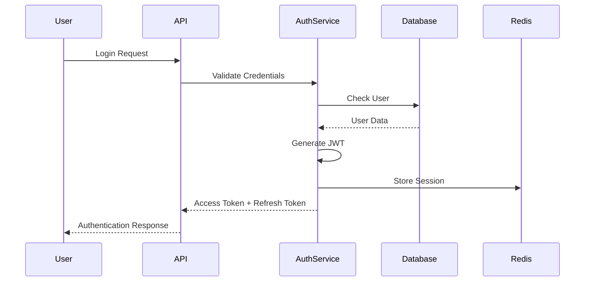
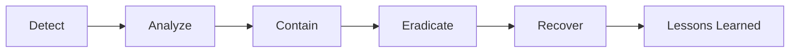

# Security Documentation

## Security Overview

The AI Chatbot System implements defense-in-depth security architecture with multiple layers of protection, ensuring data confidentiality, integrity, and availability while maintaining compliance with industry standards.

## Authentication & Authorization

### Authentication Flow



### JWT Token Structure

```json
{
  "header": {
    "alg": "HS256",
    "typ": "JWT"
  },
  "payload": {
    "user_id": "uuid",
    "tenant_id": "uuid",
    "roles": ["user", "admin"],
    "permissions": ["read", "write"],
    "exp": 1234567890,
    "iat": 1234567890,
    "jti": "unique-token-id"
  }
}
```

### API Key Management

**Key Generation**
```python
def generate_api_key():
    prefix = "sk"
    random_bytes = secrets.token_hex(32)
    return f"{prefix}-{random_bytes}"
```

**Key Storage**
- Keys are hashed using SHA-256 before storage
- Original keys are never stored
- Keys include metadata: name, tenant_id, expiry

### Multi-Factor Authentication (MFA)

**TOTP Implementation**
```python
def generate_totp_secret():
    return pyotp.random_base32()

def verify_totp(secret, token):
    totp = pyotp.TOTP(secret)
    return totp.verify(token, valid_window=1)
```

## Data Encryption

### Encryption at Rest

**Database Encryption**
- PostgreSQL: Transparent Data Encryption (TDE)
- Encryption algorithm: AES-256-GCM
- Key rotation: Every 90 days

```sql
-- Enable encryption
ALTER DATABASE chatbot SET encryption_key = pgp_sym_encrypt('key', 'master_key');
```

**Redis Encryption**
```python
def encrypt_cache_value(value: str, key: bytes) -> bytes:
    cipher = Fernet(key)
    return cipher.encrypt(value.encode())

def decrypt_cache_value(encrypted: bytes, key: bytes) -> str:
    cipher = Fernet(key)
    return cipher.decrypt(encrypted).decode()
```

### Encryption in Transit

**TLS Configuration**
```nginx
server {
    listen 443 ssl http2;
    ssl_certificate /etc/ssl/certs/cert.pem;
    ssl_certificate_key /etc/ssl/private/key.pem;
    
    ssl_protocols TLSv1.2 TLSv1.3;
    ssl_ciphers HIGH:!aNULL:!MD5;
    ssl_prefer_server_ciphers on;
    
    add_header Strict-Transport-Security "max-age=31536000" always;
}
```

## API Security

### Input Validation

**Request Validation with Pydantic**
```python
class ChatRequest(BaseModel):
    message: str = Field(..., min_length=1, max_length=4000)
    model: str = Field(..., pattern="^(gpt-4|gpt-3.5-turbo|claude-3)$")
    temperature: float = Field(0.7, ge=0, le=2)
    
    @validator('message')
    def sanitize_message(cls, v):
        # Remove potential XSS
        return bleach.clean(v, tags=[], strip=True)
```

### SQL Injection Prevention

**Parameterized Queries**
```python
async def get_user_chats(tenant_id: str, user_id: str):
    query = """
        SELECT * FROM chats 
        WHERE tenant_id = :tenant_id 
        AND user_id = :user_id
        ORDER BY created_at DESC
    """
    return await db.execute(
        query, 
        {"tenant_id": tenant_id, "user_id": user_id}
    )
```

### XSS Protection

**Content Security Policy**
```python
@app.middleware("http")
async def add_security_headers(request: Request, call_next):
    response = await call_next(request)
    response.headers["Content-Security-Policy"] = "default-src 'self'"
    response.headers["X-Content-Type-Options"] = "nosniff"
    response.headers["X-Frame-Options"] = "DENY"
    response.headers["X-XSS-Protection"] = "1; mode=block"
    return response
```

### CORS Configuration

```python
app.add_middleware(
    CORSMiddleware,
    allow_origins=["https://app.example.com"],
    allow_credentials=True,
    allow_methods=["GET", "POST"],
    allow_headers=["Authorization", "Content-Type"],
    max_age=3600
)
```

## Tenant Isolation

### Row-Level Security (RLS)

```sql
-- Enable RLS
ALTER TABLE chats ENABLE ROW LEVEL SECURITY;

-- Create policy
CREATE POLICY tenant_isolation ON chats
    FOR ALL
    USING (tenant_id = current_setting('app.tenant_id')::uuid);
```

### Resource Isolation

```python
class TenantContext:
    def __init__(self, tenant_id: str):
        self.tenant_id = tenant_id
        self.redis_prefix = f"tenant:{tenant_id}:"
        self.rate_limit_key = f"rate:{tenant_id}"
    
    def get_isolated_key(self, key: str) -> str:
        return f"{self.redis_prefix}{key}"
```

### Tenant Data Segregation

**Logical Separation**
- Each tenant has unique identifier
- All queries filtered by tenant_id
- Separate cache namespaces
- Independent rate limits

**Physical Separation (Enterprise)**
- Dedicated database schemas
- Separate Redis databases
- Isolated compute resources

## Access Control

### Role-Based Access Control (RBAC)

```python
ROLES = {
    "admin": [
        "users:read", "users:write", "users:delete",
        "chats:read", "chats:write", "chats:delete",
        "settings:read", "settings:write"
    ],
    "manager": [
        "users:read", "users:write",
        "chats:read", "chats:write",
        "settings:read"
    ],
    "user": [
        "chats:read", "chats:write"
    ]
}

def check_permission(user_role: str, required_permission: str) -> bool:
    return required_permission in ROLES.get(user_role, [])
```

### API Endpoint Protection

```python
def require_permission(permission: str):
    def decorator(func):
        @wraps(func)
        async def wrapper(*args, **kwargs):
            user = get_current_user()
            if not check_permission(user.role, permission):
                raise HTTPException(403, "Insufficient permissions")
            return await func(*args, **kwargs)
        return wrapper
    return decorator

@app.post("/api/v1/users")
@require_permission("users:write")
async def create_user(user_data: UserCreate):
    # Implementation
```

## Secrets Management

### Environment Variables

```python
class Settings(BaseSettings):
    database_url: SecretStr
    redis_url: SecretStr
    jwt_secret: SecretStr
    openai_api_key: SecretStr
    anthropic_api_key: SecretStr
    encryption_key: SecretStr
    
    class Config:
        env_file = ".env"
        env_file_encoding = "utf-8"
```

### Key Rotation

```python
async def rotate_encryption_keys():
    """Rotate encryption keys every 90 days"""
    new_key = Fernet.generate_key()
    old_key = await get_current_key()
    
    # Re-encrypt with new key
    async for item in get_encrypted_items():
        decrypted = decrypt(item.data, old_key)
        encrypted = encrypt(decrypted, new_key)
        await update_item(item.id, encrypted)
    
    await store_new_key(new_key)
    await archive_old_key(old_key)
```

## Audit Logging

### Audit Log Structure

```python
class AuditLog(BaseModel):
    timestamp: datetime
    user_id: str
    tenant_id: str
    action: str
    resource: str
    resource_id: str
    ip_address: str
    user_agent: str
    result: str
    metadata: Dict[str, Any]
```

### Critical Events Logging

```python
CRITICAL_EVENTS = [
    "user.login",
    "user.logout",
    "user.password_change",
    "api_key.create",
    "api_key.revoke",
    "tenant.create",
    "tenant.delete",
    "permission.grant",
    "permission.revoke",
    "data.export",
    "data.delete"
]

async def log_critical_event(event: str, **kwargs):
    if event in CRITICAL_EVENTS:
        await audit_logger.log(
            level="CRITICAL",
            event=event,
            **kwargs
        )
```

## Vulnerability Management

### Dependency Scanning

```yaml
# .github/workflows/security.yml
name: Security Scan
on: [push, pull_request]

jobs:
  security:
    runs-on: ubuntu-latest
    steps:
      - uses: actions/checkout@v2
      
      - name: Run Snyk Security Scan
        uses: snyk/actions/python@master
        env:
          SNYK_TOKEN: ${{ secrets.SNYK_TOKEN }}
      
      - name: Run Bandit Security Linter
        run: |
          pip install bandit
          bandit -r api/ -f json -o bandit-report.json
      
      - name: SAST with Semgrep
        uses: returntocorp/semgrep-action@v1
```

### Security Headers

```python
SECURITY_HEADERS = {
    "Strict-Transport-Security": "max-age=31536000; includeSubDomains",
    "X-Content-Type-Options": "nosniff",
    "X-Frame-Options": "DENY",
    "X-XSS-Protection": "1; mode=block",
    "Referrer-Policy": "strict-origin-when-cross-origin",
    "Permissions-Policy": "geolocation=(), microphone=(), camera=()"
}
```

## Compliance

### GDPR Compliance

**Data Subject Rights**
```python
class GDPRService:
    async def export_user_data(user_id: str) -> Dict:
        """Right to data portability"""
        return await gather_all_user_data(user_id)
    
    async def delete_user_data(user_id: str) -> bool:
        """Right to erasure"""
        return await anonymize_user_data(user_id)
    
    async def update_consent(user_id: str, consents: Dict) -> bool:
        """Consent management"""
        return await store_user_consents(user_id, consents)
```

### SOC 2 Controls

| Control | Implementation | Evidence |
|---------|---------------|----------|
| CC6.1 | Logical access controls | JWT tokens, RBAC |
| CC6.2 | User registration/deregistration | Audit logs |
| CC6.3 | Access privilege management | Permission system |
| CC6.6 | Encryption of data | TLS, AES-256 |
| CC6.7 | Authentication mechanisms | MFA, API keys |

### PCI DSS Requirements

**Requirement 3: Protect stored data**
- Encryption at rest ✓
- Key management ✓
- Data retention policies ✓

**Requirement 8: Identify and authenticate access**
- Unique user IDs ✓
- Strong passwords ✓
- MFA implementation ✓

## Incident Response

### Incident Response Plan



### Security Incident Handling

```python
class SecurityIncidentHandler:
    async def handle_breach(self, incident_type: str):
        # 1. Immediate containment
        await self.isolate_affected_systems()
        
        # 2. Assessment
        scope = await self.assess_breach_scope()
        
        # 3. Notification
        if scope.requires_notification:
            await self.notify_stakeholders(scope)
        
        # 4. Remediation
        await self.apply_security_patches()
        
        # 5. Documentation
        await self.document_incident(incident_type, scope)
```

## Security Best Practices

### Development Security

1. **Code Review Requirements**
   - Security-focused review for auth changes
   - Automated SAST scanning
   - Dependency vulnerability checks

2. **Secure Coding Standards**
   ```python
   # Good: Parameterized query
   query = "SELECT * FROM users WHERE id = %s"
   cursor.execute(query, (user_id,))
   
   # Bad: String concatenation
   # query = f"SELECT * FROM users WHERE id = {user_id}"
   ```

3. **Secret Management**
   - Never commit secrets to version control
   - Use environment variables
   - Rotate keys regularly

### Operational Security

1. **Access Control**
   - Principle of least privilege
   - Regular access reviews
   - Automated deprovisioning

2. **Monitoring**
   - Real-time security alerts
   - Anomaly detection
   - Failed authentication tracking

3. **Backup Security**
   - Encrypted backups
   - Secure storage locations
   - Regular restoration testing

## Security Monitoring

### Security Metrics

```python
SECURITY_METRICS = {
    "failed_login_attempts": Counter(),
    "api_key_usage": Histogram(),
    "permission_denials": Counter(),
    "encryption_operations": Histogram(),
    "security_events": Counter()
}
```

### Alert Rules

```yaml
- alert: HighFailedLoginRate
  expr: rate(failed_login_attempts[5m]) > 10
  annotations:
    summary: "High rate of failed login attempts"

- alert: UnusualAPIKeyUsage
  expr: api_key_usage > 1000
  annotations:
    summary: "Unusual API key usage pattern"

- alert: EncryptionFailure
  expr: encryption_failures > 0
  annotations:
    summary: "Encryption operation failed"
```

## Security Checklist

### Pre-Deployment
- [ ] All dependencies updated
- [ ] Security scanning passed
- [ ] Secrets properly configured
- [ ] TLS certificates valid
- [ ] Security headers configured

### Post-Deployment
- [ ] Monitor security alerts
- [ ] Review audit logs
- [ ] Check for unusual patterns
- [ ] Verify encryption working
- [ ] Test authentication flow

### Periodic Reviews
- [ ] Quarterly security assessment
- [ ] Annual penetration testing
- [ ] Bi-annual security training
- [ ] Monthly vulnerability scanning
- [ ] Weekly security updates review